# Shop — Full-Stack PHP Classifieds & E-Commerce Platform

🌐 Websites. A complete, full-stack **classifieds/marketplace web application** built with **PHP**, **MySQL (PDO)**, and **Bootstrap 3**. Features a dual-area architecture with a user-facing storefront and a fully separate **Admin Panel**, a double approval workflow for users and items, a threaded comments system, hierarchical categories, a tags system, and multilingual support (English & Arabic).

---

## 📸 Preview

| | | |
|---|---|---|
| 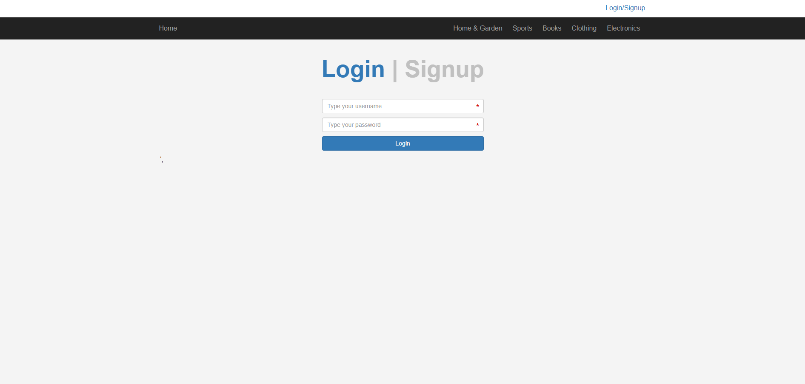 | 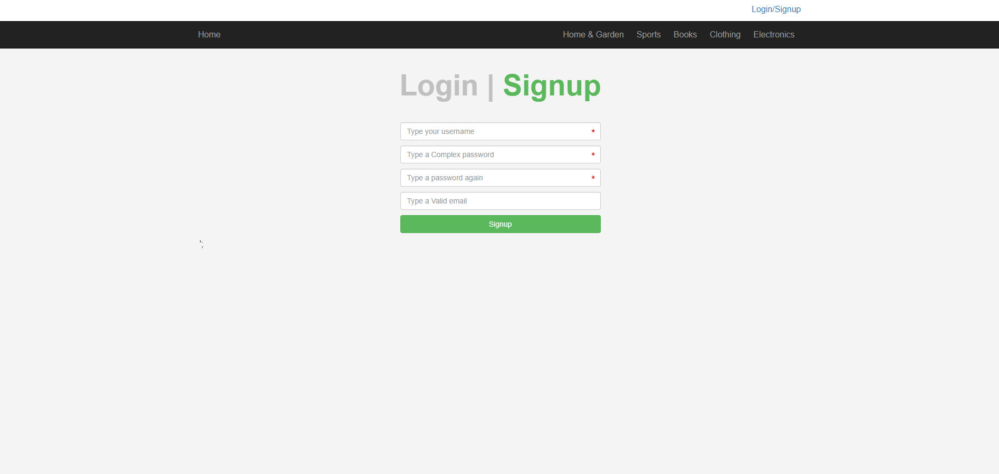 | 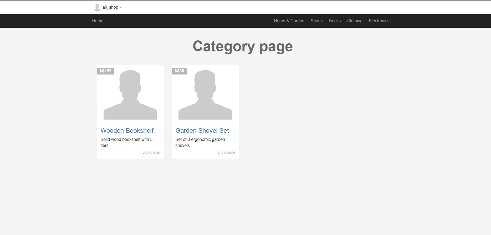 |
| 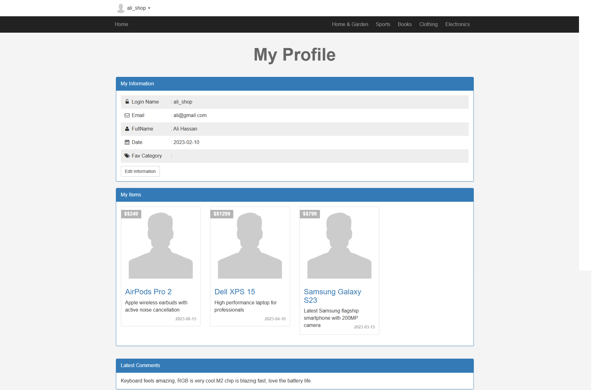 | 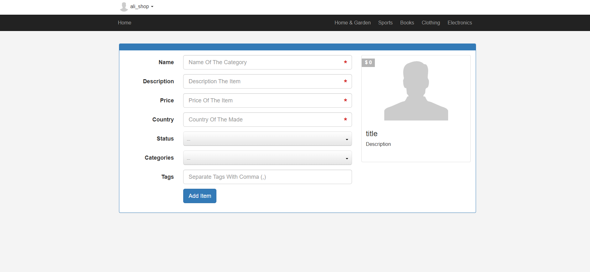 | 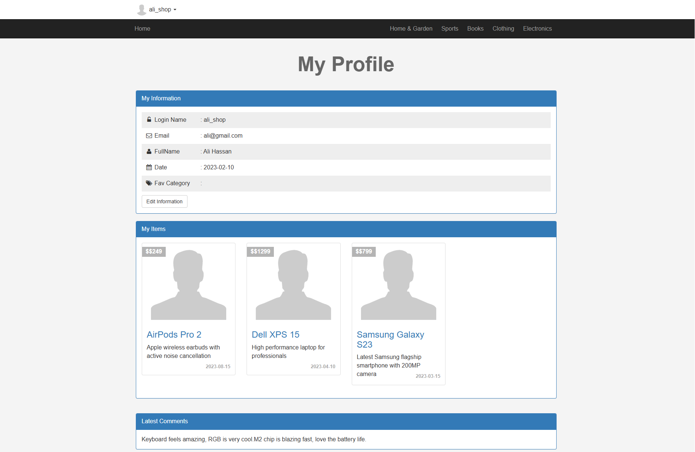 |
| 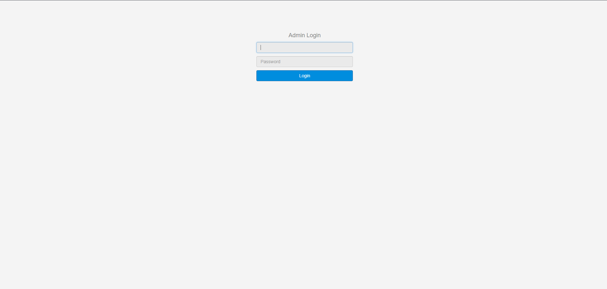 | 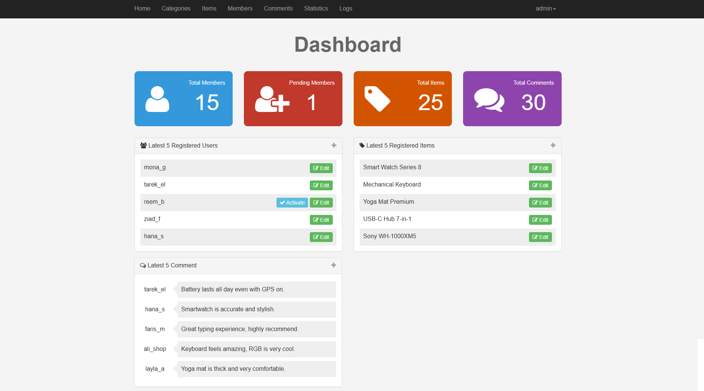 | 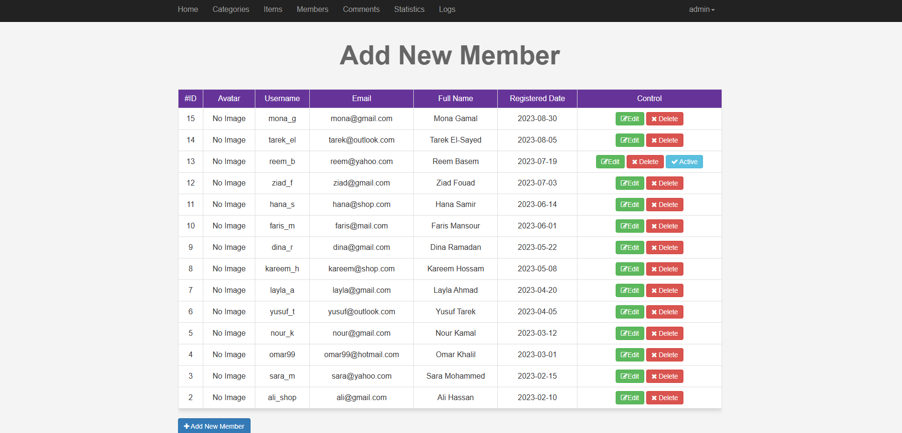 |
| 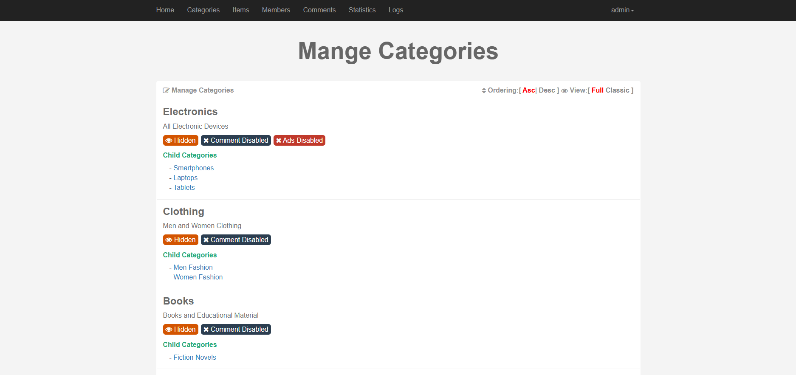 | 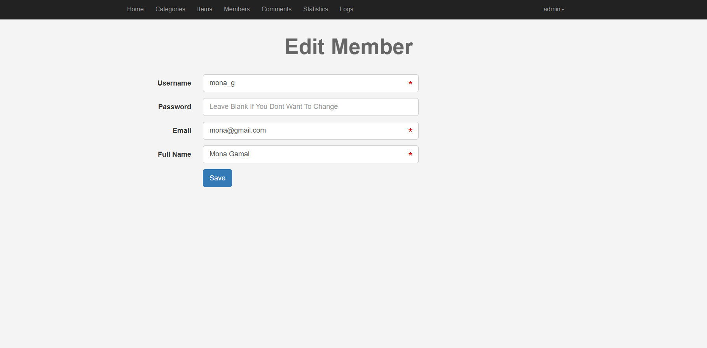 | 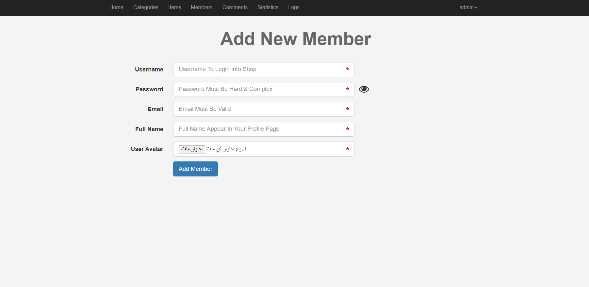 |

---

## ✨ Features

### 🛒 Frontend (User-Facing)
- **Item Listing** — Responsive Bootstrap 3 grid of all approved items with price tag overlay
- **Item Detail Page** — Full item info: name, description, price, country of origin, category link, tags, seller username
- **Tags System** — Each item can have multiple comma-separated tags; click any tag to browse related items
- **Category Browser** — Hierarchical categories with parent/child structure; each category can control comments and ad permissions
- **Live Ad Preview** — The "Post New Ad" form shows a real-time Bootstrap card preview as the user types (name, description, price)
- **Comments System** — Logged-in users can comment on any approved item; comments require admin approval before appearing
- **User Registration & Login** — Single-page Login/Signup with tab toggle; SHA1 password hashing; session-based authentication
- **User Profile** — Personal profile page for each registered member
- **Auto-Redirect with Timer** — `redirectHome()` displays a message and redirects after 3 seconds for any error or success event

### 🔒 Admin Panel (`/admin/`)
- **Dashboard** — Live stats (Total Members, Pending Members, Total Items, Total Comments) + latest 5 records of each
- **Member Management** — View all users, activate/deactivate accounts, edit user details
- **Item Management** — View all items, approve/reject listings, edit item details
- **Category Management** — Full CRUD for hierarchical categories (parent/child, visibility, permissions)
- **Comments Moderation** — View and moderate all user comments
- **Tags Management** — Manage item tags across the platform
- **Pages Management** — Static page content management
- **Session Protection** — All admin pages redirect to login if no active session

### 🛡️ Security
- **PDO Prepared Statements** — All database queries use bound parameters; no raw SQL string concatenation
- **`filter_var()` Sanitization** — All form inputs sanitized (`FILTER_SANITIZE_STRING`, `FILTER_SANITIZE_EMAIL`, `FILTER_SANITIZE_NUMBER_INT`)
- **SHA1 Password Hashing** — Passwords never stored as plain text
- **Session-Based Auth** — Separate session variables for admin (`$_SESSION['username']`) and frontend user (`$_SESSION['user']`)
- **Output Buffering** — `ob_start()` / `ob_end_flush()` used on all form-processing pages to allow `header()` redirects after output
- **Numeric ID Validation** — `is_numeric()` + `intval()` on all URL parameters to prevent injection via GET

### 🌐 Multilingual
- **English** (`includes/languages/en.php`)
- **Arabic** (`includes/languages/ar.php`)
- Switch language by changing the `$lan` path variable in `init.php`

---

## 🗂️ Project Structure

```
eCemommerce/
│
├── index.php               # Homepage — grid of all approved items
├── item.php                # Single item detail + comments
├── categories.php          # Browse items by category
├── tags.php                # Browse items by tag
├── newAds.php              # Post a new classified ad (auth required)
├── profile.php             # User profile page
├── login.php               # Login + Signup (single page, tab toggle)
├── logout.php              # Session destroy + redirect
├── init.php                # Bootstrap file — loads DB, paths, functions, header
├── shop.sql                # Full database dump (schema + sample data)
│
├── includes/
│   ├── functions/
│   │   └── functions.php   # Shared PHP helper functions (versioned)
│   ├── languages/
│   │   ├── en.php          # English language strings
│   │   └── ar.php          # Arabic language strings
│   └── templates/
│       ├── header.php      # HTML <head> + navbar
│       └── footer.php      # Closing tags + scripts
│
├── layout/
│   ├── css/
│   │   ├── front.css       # Frontend custom styles
│   │   ├── bootstrap.min.css
│   │   ├── all.min.css     # Font Awesome 6
│   │   ├── font-awesome.min.css  # Font Awesome 4
│   │   ├── normalize.css
│   │   ├── jquery-ui.css
│   │   └── jquery.selectBoxIt.css
│   └── js/
│       ├── front.js        # Frontend jQuery interactions + live preview
│       ├── jquery-1.12.1.min.js
│       ├── bootstrap.min.js
│       ├── jquery-ui.min.js
│       └── jquery.selectBoxIt.min.js
│
├── admin/                  # ── Admin Panel ──────────────────────
│   ├── index.php           # Admin login page
│   ├── dashboard.php       # Stats overview + latest records
│   ├── members.php         # User management
│   ├── items.php           # Item management
│   ├── Categories.php      # Category management
│   ├── comment.php         # Comments moderation
│   ├── tags.php            # Tags management
│   ├── page.php            # Static pages management
│   ├── newAds.php          # Admin post new item
│   ├── profile.php         # Admin profile
│   ├── template.php        # Template management
│   ├── logout.php          # Admin session destroy
│   ├── connect.php         # PDO database connection
│   ├── init.php            # Admin bootstrap file
│   ├── includes/
│   │   ├── functions/
│   │   │   └── functions.php   # Admin PHP helper functions
│   │   ├── languages/
│   │   │   ├── en.php
│   │   │   └── ar.php
│   │   └── templates/
│   │       ├── header.php
│   │       ├── footer.php
│   │       └── navbar.php      # Admin sidebar/navbar
│   ├── layout/
│   │   ├── css/backend.css     # Admin panel custom styles
│   │   └── js/backend.js       # Admin jQuery (panel toggle, etc.)
│   └── uploads/avatars/        # User avatar uploads directory
│
└── imageGithub/            # Preview screenshots for README
    └── 1.png – 12.png
```

---

## 🗄️ Database Schema

**Database name:** `shop`  
**Charset:** `utf8mb4`  
**Engine:** InnoDB (with Foreign Key constraints)

### Tables

#### `users`
| Column | Type | Notes |
|---|---|---|
| `UserID` | INT AUTO_INCREMENT | Primary Key |
| `Username` | VARCHAR(255) | UNIQUE |
| `Password` | VARCHAR(255) | SHA1 hashed |
| `Email` | VARCHAR(255) | |
| `FullName` | VARCHAR(255) | |
| `GroupID` | INT | `1` = Admin, `0` = Regular user |
| `TrustStatus` | INT | Seller trust rank |
| `RegStatus` | INT | `0` = Pending, `1` = Active |
| `Date` | DATE | Registration date |
| `avatar` | VARCHAR(255) | Avatar filename |

#### `items`
| Column | Type | Notes |
|---|---|---|
| `Item_ID` | INT AUTO_INCREMENT | Primary Key |
| `Name` | VARCHAR(255) | |
| `Description` | TEXT | |
| `Price` | VARCHAR(255) | |
| `Add_Date` | DATE | |
| `Country_Made` | VARCHAR(255) | |
| `Image` | VARCHAR(255) | Image filename |
| `Status` | VARCHAR(255) | `1`=New, `2`=Like New, `3`=Used, `4`=Very Old |
| `Rating` | SMALLINT | Item rating |
| `Approve` | TINYINT | `0` = Pending, `1` = Approved |
| `Cat_ID` | INT | FK → `categories.ID` |
| `Member_ID` | INT | FK → `users.UserID` |
| `tags` | VARCHAR(255) | Comma-separated tags |

#### `comments`
| Column | Type | Notes |
|---|---|---|
| `c_id` | INT AUTO_INCREMENT | Primary Key |
| `comment` | TEXT | |
| `status` | TINYINT | `0`=Pending, `1`=Approved |
| `comment_date` | DATE | |
| `item_id` | INT | FK → `items.Item_ID` (CASCADE) |
| `user_id` | INT | FK → `users.UserID` (CASCADE) |

#### `categories`
| Column | Type | Notes |
|---|---|---|
| `ID` | INT AUTO_INCREMENT | Primary Key |
| `Name` | VARCHAR(255) | UNIQUE |
| `Description` | TEXT | |
| `parent` | INT | `0` = root category, else = parent `ID` |
| `Ordering` | INT | Display order |
| `Visibility` | TINYINT | `0`=Hidden, `1`=Visible |
| `Allow_Comment` | TINYINT | Toggle comments per category |
| `Allow_Ads` | TINYINT | Toggle new ads per category |

### Foreign Key Constraints

```sql
comments.user_id  → users.UserID      (ON DELETE CASCADE, ON UPDATE CASCADE)
comments.item_id  → items.Item_ID     (ON DELETE CASCADE, ON UPDATE CASCADE)
items.Cat_ID      → categories.ID     (ON DELETE CASCADE, ON UPDATE CASCADE)
items.Member_ID   → users.UserID      (ON DELETE CASCADE, ON UPDATE CASCADE)
```

---

## ⚙️ PHP Helper Functions

All helpers are versioned and documented inside `includes/functions/functions.php`:

| Function | Version | Purpose |
|---|---|---|
| `getAllFrom($field, $table, $condition, $orderField, $ordering, $limit)` | v3 | Universal `SELECT` with conditions, ordering, and limit |
| `checkCount($select, $table, $condition)` | v2 | Count matching rows in any table |
| `checkUserStatus($user)` | v1.1 | Check if a user is active (`RegStatus=0` = pending) |
| `getLatest($select, $table, $order, $limit)` | v1 | Fetch the latest N records |
| `getTitle()` | v1 | Echo the current page title or "Default" |
| `redirectHome($msg, $url, $seconds)` | v2 | Display a message and auto-redirect after N seconds |

### Usage examples

```php
// Fetch all approved items ordered by ID descending
$items = getAllFrom('*', 'items', 'Approve=1', 'Item_ID');

// Count pending users
$pending = checkCount('UserID', 'users', 'RegStatus=0');

// Get last 5 registered users
$latest = getLatest('*', 'users', 'UserID', 5);

// Redirect with error message after 3s
redirectHome("<div class='alert alert-danger'>Access Denied</div>", 'back');
```

---

## 🚀 Getting Started

### Prerequisites

- **PHP** 5.6+ (or 7.x / 8.x)
- **MySQL** 5.6+ (or MariaDB 10.x)
- **Apache** with `mod_rewrite` enabled
- **XAMPP**, **WAMP**, **MAMP**, or any LAMP stack

### 1. Clone the repository

```bash
git clone https://github.com/your-username/eCemommerce.git
```

### 2. Move to your web server root

```bash
# XAMPP example
cp -r eCemommerce /Applications/XAMPP/htdocs/shop

# Linux LAMP
cp -r eCemommerce /var/www/html/shop
```

### 3. Import the database

1. Open **phpMyAdmin** → `http://localhost/phpmyadmin`
2. Create a new database named **`shop`**
3. Click **Import** → select `shop.sql` → click **Go**

Or via the MySQL CLI:
```bash
mysql -u root -p -e "CREATE DATABASE shop CHARACTER SET utf8mb4;"
mysql -u root -p shop < shop.sql
```

### 4. Configure the database connection

Edit `admin/connect.php`:
```php
$dsn  = 'mysql:host=localhost;dbname=shop';
$user = 'root';       // ← your MySQL username
$pass = '';           // ← your MySQL password
```

### 5. Open in your browser

```
http://localhost/shop/             # Frontend
http://localhost/shop/admin/       # Admin Panel
```

---

## 🔑 Default Login Credentials

> ⚠️ **Change these immediately** before any public deployment.

### Admin Panel (`/admin/`)
| Username | Password | GroupID |
|---|---|---|
| `Osama` | `elzero` | 1 (Admin) |

### Frontend Sample Users
| Username | Password |
|---|---|
| `Ahmed` | `12345` |
| `Gamal` | `12345` |
| `Khalid` | `12345` |

---

## 📋 Workflows

### Item Approval Flow

```
User posts new ad → Approve = 0 (Pending)
Admin visits items.php → clicks "Approve"
Approve = 1 → Item appears on homepage and category pages
```

### User Registration Flow

```
User registers → RegStatus = 0 (Pending)
Admin visits members.php → clicks "Activate"
RegStatus = 1 → User can now log in and post ads
```

### Comment Moderation Flow

```
Logged-in user posts comment → status = 0 (Pending)
Admin visits comment.php → approves comment
status = 1 → Comment appears on item page
```

---

## 🛠️ Built With

| Technology | Version | Purpose |
|---|---|---|
| PHP | 5.6+ | Server-side logic & templating |
| MySQL / MariaDB | 5.6+ / 10.x | Relational database |
| PDO | — | Database abstraction with prepared statements |
| [Bootstrap](https://getbootstrap.com/docs/3.4/) | 3.x | Responsive frontend UI |
| [jQuery](https://jquery.com/) | 1.12.1 | DOM manipulation, live preview, AJAX |
| [jQuery UI](https://jqueryui.com/) | — | Enhanced form controls |
| [jQuery SelectBoxIt](https://gregfranko.com/jquery.selectBoxIt.jquery/) | — | Styled select dropdowns |
| [Font Awesome](https://fontawesome.com/) | 4 + 6 | Icon libraries (both versions included) |
| [Glyphicons](https://getbootstrap.com/docs/3.4/components/#glyphicons) | — | Bootstrap icon font |

---

## 🌐 Browser Support

| Browser | Support |
|---|---|
| Chrome | ✅ Latest |
| Firefox | ✅ Latest |
| Safari | ✅ Latest |
| Edge | ✅ Latest |
| IE 9+ | ✅ (Bootstrap 3 supported) |

---

## 📝 Customization Guide

**Change DB credentials:** Edit `admin/connect.php` — change `$dsn`, `$user`, `$pass`.

**Switch language to Arabic:** In `init.php`, change:
```php
include $lan . 'en.php';
// → 
include $lan . 'ar.php';
```

**Add a new category:** Go to `Admin Panel → Categories → Add New`. Set `parent = 0` for a root category, or choose a parent ID for subcategories.

**Add a new admin user:** In phpMyAdmin, insert into `users` with `GroupID = 1` and `RegStatus = 1`. Password must be `sha1('your-password')`.

**Change redirect timer:** The default is 3 seconds. Pass a custom value to `redirectHome()`:
```php
redirectHome($msg, 'index.php', 5);  // redirect after 5 seconds
```

---

## ⚠️ Security Notice

This project was built for **educational purposes**. Before deploying to production:

- Replace `SHA1` hashing with `password_hash()` / `password_verify()` (bcrypt)
- Move `connect.php` credentials to an `.env` file outside the web root
- Add CSRF token protection to all forms
- Enable HTTPS
- Remove `ini_set('display_errors', 'On')` from `init.php`

---

## 📜 License

This project is open-source and available under the [MIT License](LICENSE).

---

## 🙋 Author

**Alilo Alaedine**
- GitHub: [@BoutefahaAlaeddine](https://github.com/BoutefahaAlaeddine)

---

> ⭐ If you found this project useful, consider giving it a star on GitHub!
